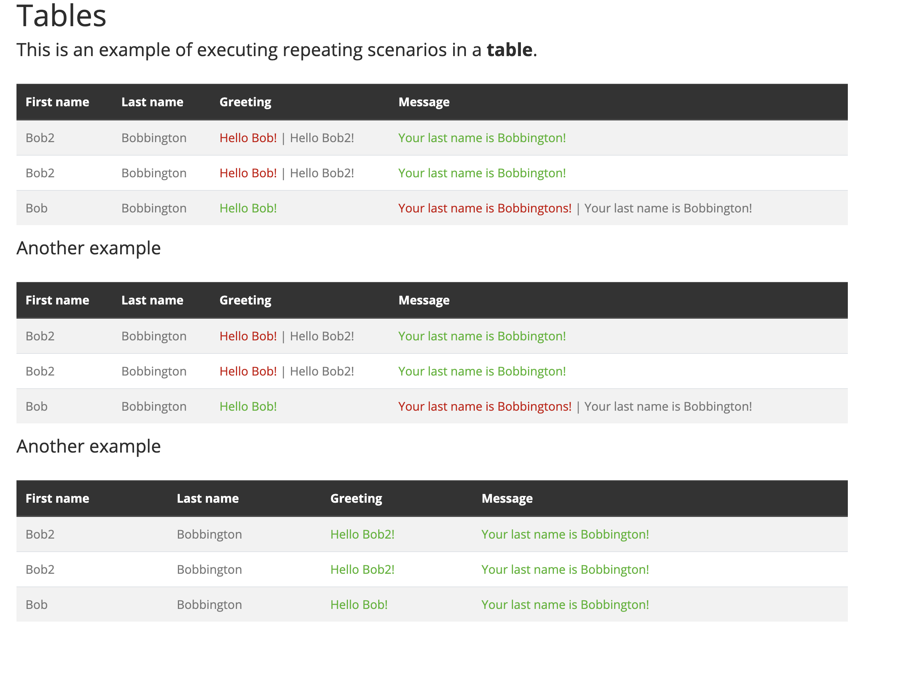
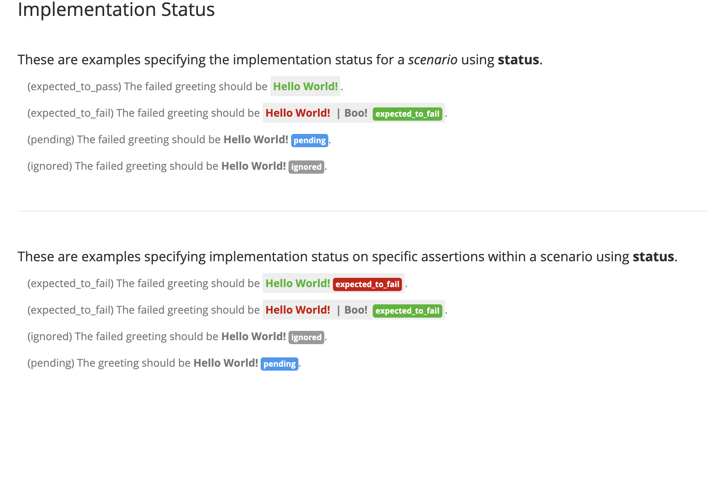
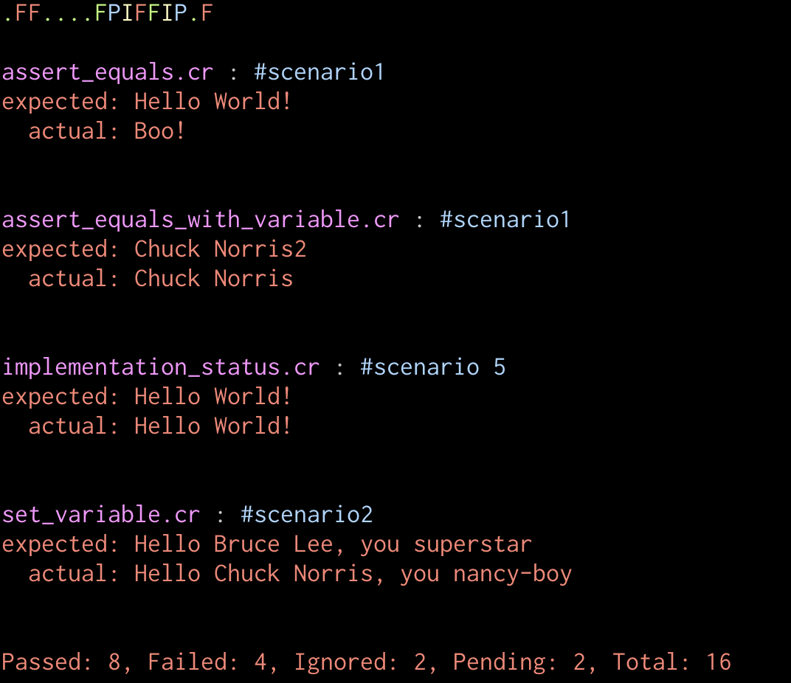

# spinach

BDD Style spec runner for Crystal. This project is fairly experimental and was written in a day so will be gradually improved over time. Please raise any feature requests or bugs.

## Installation

1. Add the dependency to your `shard.yml`:

   ```yaml
   dependencies:
     spinach:
       github: sushichain/spinach
   ```

2. Run `shards install`

## Usage

```crystal
require "spinach"
```

The basic concept is that you write executable specifications in an HTML file that has a companion supporting crystal file. You then execute the crystal file and it will execute a spec and produce an augmented HTML file with the results.

You put your html file and supporting crystal file in the `spec` folder.

There are 3 directives:

* scenario
* table_scenario
* assert_equals
* set
* execute
* status

In your HTML you use these to write the specs. See below. See also the specs of this project for examples.

For each scenario the directives are located and then executed. The order in which directives are located is as follows:

1. table_scenario
2. scenario
3. set
4. execute
5. assert_equals
6. status

## Scenario

```html
<div spinach:scenario="#scenario1">
  If my name is <b spinach:set="#username">Chuck Norris</b>.<br/>
  Then my username should be <b spinach:assert_equals="#username">Chuck Norris2</b>.
</div>
```

Each spec file must contain at least one scenario. A scenario is used to provide scope for the commands. When a spec runs
the variables used in the scenario are scoped to that specific scenario. So a scenario **MUST** be placed on a `Div` HTML element that
is a parent and then all the spec commands should go on HTML nodes that are children of this parent node. See the specs folder for
examples

## Table Scenario

```html
  <table spinach:table_scenario="scenario 1" class="table table-striped">
      <thead class="thead-dark">
        <tr>
          <th spinach:set="firstname">First name</th>
          <th spinach:set="lastname">Last name</th>
          <th spinach:assert_equals="greeting.login_greeting">Greeting</th>
          <th spinach:assert_equals="greeting.login_message">Message</th>
          <th spinach:execute="greeting = greeting_for(firstname, lastname)"></th>
        </tr>
        </thead/>
        <tbody>
          <tr>
            <td>Bob2</td>
            <td>Bobbington</td>
            <td>Hello Bob!</td>
            <td>Your last name is Bobbington!</td>
            <td></td>
          </tr>
        </tbody>
    </table>
```
You add `spinach:table_scenario` to the table and then define your directives in the first row of the `thead`. You must use the `thead` and `tbody` elements. Also you must **NOT** put any directives on the first `tr` in the `thead` and instead only put directives on the `th` nodes. This is because each `tr` will be turned into a scenario and the appropriate directives dynamically added.



## Set Variable

```html
<p>
  If my username is <b spinach:set="#username">Chuck Norris</b>.
  Then the system should greet me with <b spinach:assert_equals="greeting_for(#username)">Hello Chuck Norris</b>.
</p>
```
This will set the value `Chuck Norris` onto a variable called `#username` which you can use in a later assert_equals to assert a value.


## Assert Equals

```html
<blockquote>
  The greeting should be <b spinach:assert_equals="get_greeting()">Hello World!</b>.
</blockquote>
```

This will assert the value returned by the method `get_greeting` with the supplied text: `Hello World!`

The return type of `get_greeting` **MUST** be a `String`


A second way to use assert_equals is when there is just a variable being asserted - either that has been set in the html or that is the result of an execute.


```html
<p>
  If my name is <b spinach:set="#username">Chuck Norris</b>.<br/>
  Then my username should be <b spinach:assert_equals="#username">Chuck Norris</b>.
</p>
```


## Execute

```html
<p spinach:execute="#greeting = greeting_for(#firstname, #lastname)">
  The greeting <b spinach:assert_equals="#greeting.login_greeting">Hello Bob!</b><br/>
  And the message <b spinach:assert_equals="#greeting.login_message">Your last name is Bobbington!</b><br/>
  should be given to user <b spinach:set="#firstname">Bob</b> <b spinach:set="#lastname">Bobbington</b><br/>
  when he logs in.
</p>
```

This will store the result of the method `greeting_for` in a result `HashMap` which you can then use in later asserts.

When returning a result in an execute you **MUST** return a `HashMap`


## Implementation Status

```html
<div spinach:scenario="#scenario 2" spinach:status="expected_to_fail">
  <blockquote>
    (expected_to_fail) The failed greeting should be <b spinach:assert_equals="failed_greeting()">Hello World!</b>.
  </blockquote>
</div>

```

You can add the `status` directive to either the node with `spinach:scenario` to apply it to the whole scenario or you can add it to a specific assert_equals node.



## Running

To run a spec you can do the following:

NOTE - if you get a compiler crash while running then use the `--no-debug` flag when running and report the crash to the Crystal devs. Depending on what you put in the mapping Proc might cause the compiler to crash.

e.g `crystal run --no-debug spec/*.cr` or `crystal run spec/individual_file.cr`

but in general:

`crystal run spec/*.cr` or `crystal run spec/individual_file.cr`

if you want to put your specs somewhere else you can also do this:

`crystal run spec/spinach/*.cr -- -l "spec/spinach"`

There is a basic command line report:



* a green dot is passed
* a red F is failed
* a green F is failed but expected to fail
* a yellow I is ignored
* a blue P is pending

## Writing Specs

In the `spec` folder of your project you write 2 files:

1. assert_something.cr
2. assert_something.html

The names of the files must be the same. Also the name of the class in the crystal file must be the camel case equivalent of the file name. e.g. assert_something.cr must have a class called `AssertSomething`

here is an example of the files:

```crystal
class AssertEquals < SpinachTestCase

  def mapping
    {
      "get_greeting": ->(args : Array(String)){ get_greeting }
    }
  end

  def get_greeting
    "Hello World!"
  end

end
```

You must extend from `SpinachTestCase`. You must also provide a mapping between the base name of the method and a proc containing the methods to execute during the running of the spec.

The Proc **MUST** always be in the format: `->(args : Array(String){ some_method_call }`
The method can optionally take the arguments if needed.

```html
<html>

<head>
  <link rel="stylesheet" href="https://stackpath.bootstrapcdn.com/bootswatch/4.3.1/spacelab/bootstrap.min.css">
</head>

<body>
  <div class="container">
    <h1>Assert Equals</h1>
    <h4>This is an example of a basic assertion using <b>assert_equals</b>.</h4>
    <p>
      <blockquote>
        The greeting should be <b spinach:assert_equals="get_greeting()">Hello World!</b>.
      </blockquote>
    </p>
  </div>
</body>

</html>
```

## Development

When running the specs locally in the project use this:

`crystal run --no-debug spec/*.cr -- -l "./projects/spinach/spec"`

## Contributing

1. Fork it (<https://github.com/sushichain/spinach/fork>)
2. Create your feature branch (`git checkout -b my-new-feature`)
3. Commit your changes (`git commit -am 'Add some feature'`)
4. Push to the branch (`git push origin my-new-feature`)
5. Create a new Pull Request

## Contributors

- [Kingsley Hendrickse](https://github.com/kingsleyh) - creator and maintainer
